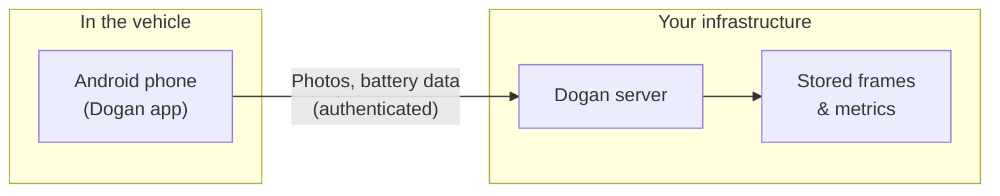

# System Context

How Dogan fits into the overall product and what moves between the phone and the server.

## Components

| Component | Role |
|-----------|------|
| **Dogan app (this project)** | Runs on an Android phone in or near the vehicle. Captures photos, reads battery state, detects motion, uploads frames for cloud object detection. |
| **Dogan server (separate project)** | Receives uploads, stores the latest frames and device metrics, runs server-side object detection, exposes APIs for retrieval and administration. |

The app is not a standalone cloud product—it is the **edge client** that feeds a server you deploy and operate (or host via a provider).

## Data flow (conceptual)

### When monitoring is active

1. User selects an active mode on the main grid (not OFF). CaptureService runs on-device detection on a camera duty cycle (open → still → close), unless Preview or recording needs continuous camera.
2. On each FPS interval (and on motion events), when connected:
   - A photo may be taken and uploaded (image upload defaults to on-demand).
   - Battery level and temperature are recorded and sent.
3. Photos and metrics are sent securely using a bearer token from username/password login (only while Connected).
4. Each phone is identified by a stable **device ID** (derived from the phone itself) so the server can distinguish multiple vehicles or deployments.
5. The phone runs YOLO26 NCNN detection locally when a mode is active (including bounding boxes on Preview); the server may also analyze uploaded frames when connected.

### Authentication

The phone authenticates with **username and password** on Connectivity (`POST /api/v1/auth`). The returned bearer token authorizes both REST API calls and LiveKit session creation (`POST /webrtc/session`). Dev defaults live in repo-root `credentials.txt`.

## Device identity

Each installation is treated as one **device** on the server, identified automatically by the phone. Operators use this ID on the server side to tell which vehicle or phone sent a given frame or metric reading. No manual device registration is required in the app.

## Deployment scenarios

| Scenario | Description |
|----------|-------------|
| **Home / lab** | Phone and server on the same Wi‑Fi; server address is `http://<host-ip>:8090/dogan` (Docker `DOGAN_API_PORT` default). |
| **Hosted server** | Server on the public internet; phone uses HTTPS URL with `/dogan` path (default `https://dogan-api.xaigrok.ir/dogan`); LiveKit default `wss://dogan-livekit.xaigrok.ir`; requires stable connectivity from the parking location. |

## Privacy and data considerations

- **Camera data** — Photos are captured only while monitoring is active. They are sent only to the server address the user configures.
- **Location** — The app does **not** report GPS or location in the current version.
- **Local history** — The app keeps a browsable **history frames** gallery per mode (ring buffer of JPEGs + bounding boxes) sized by history retention.
- **Permissions** — Camera and network access are required for full operation; users must explicitly grant camera permission.

Stakeholders should align server retention, access control, and privacy policies with how frames and metrics are stored on the backend.

## Relationship to other documentation

- **This folder** — Product and operational view of the Android app.
- **Dogan server documentation** — API details, administration, and storage (maintained in the server repository).
- **Project README** — Developer-oriented build and run instructions (not intended for managers).
